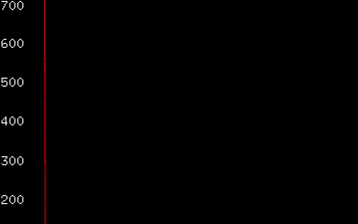

# Division-occurrence

Division occurence is an audio visual project that aims to explore the multi definition of space through sound. Heavily insipred by graphic music notation, the flexibility of experimental music notation enables performers to expand(vertical or horizontal), contract, or remain the space as it seems to be. Releasing nodes from two dimension to freely float to right, left, back, forward, up, down, and all points between without reading direction. Composers are regarding sound as points that scatter in the space of notation, enabling performers to start from random point and connect them freely, the space can expand, shrink or remain as defined.

The notion of space itself, as it is used in music – as well as in many other fields – has many senses; as the French writer Georges Perecwould say, there are »spaces of space«.
I see sound as a way to position points as vectors and by iterating them constructs the space. In this project, I use hand movements in physical world as a trigger of energy that change the audio output and camera movements.

Technical and process
This project aims to create music only with pure sine waves with sound effects like envelopes, filters, frequency modulation and so on. The biggest challenge I encountered is mapping the sound data to create visuals. I have try different numbers of mapping to see the results match the sound or not.

-ofxOsc

I use touchOsc to send accelerometer data to openframework and map the xy value(-1~1) to the position on the screen. The data is very glitchy. Without using low pass filter, the point on the screen will be very rough and irregular.

-ofxMaxim

The audio is based on sinewaves with 8 different pitches. Metronome ticks per 7 frames every so often. Iteration increase every 4 bars, the pitch will also change based on the root chords for the arpeggio. The osc messages are mapped into physical position on the screen, and also influencing the audio output, x position as the cutoff point of the lowpass filter, y position as the resonance of the filter.

Instruction:

1. Use TouchOsc or any other application that send osc accelerometer message to openframework
2. Define sender port number in ofApp.h 
3. Run the app and manipulate the visual and audio with hand movements :)
